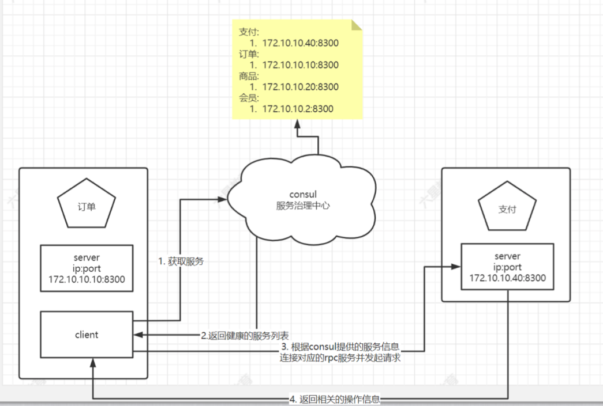

# 一、gin 与 micro 结合

## （一）micro 作为 grpc 服务端
micro 作为 grpc 服务端提供 grpc 服务


## （二）gin 作为 grpc 客户端
gin 作为 grpc 客户端通过 grpc 调用 micro 服务, 并提供 http 路由地址给前端调用


# 二、利用hystrix实现熔断
服务熔断一般是指软件系统中,由于某些原因使得服务出现了过载现象, 为防止造成整个系统故障

## （一）Hystrix作用

1. 服务隔离和服务熔断;

2. 服务降级、快速失败和限流;

3. 请求合并和请求缓存;

4. 自带单体和集群监控
> 下载方式： go get github.com/afex/hystrix-go

## （二）主要方法
```
type runFunc func() error // 实际执行方法
type fallbackFunc func(error) error // 服务降级方法
func Do(name string, run runFunc, fallback fallbackFunc)

```

# 三、服务降级
## （一）服务降级
服务降级是在服务器压力陡增的情况下，利用有限资源，
根据当前业务情况，关闭某些服务接又或者页面，
以此释放服务器资源以保证核心任务的正常运行

## （二）连接redis实现服务降级
go > 连接 redis 驱动
> 下载方式：go get github.com/go-redis/redis/v8

## （三）应用场景
1. 在服务熔断的之后无法获取到数据的情况下运用
2. 在流量剧增的情况下，对于一些流量采用降级的方式应对


# 五、Micro与hystrix结合
## Micro 中间件
> 参考链接：https://github.com/asim/go-micro/tree/master/plugins/wrapper

Micro的中间件类型有如下这几个类型;在go-micro/options.go中定义
```
func WrapClient(w ...client.Wrapper) Option 
    用于用一些中间件组件包装Client,包装器以相反的顺序应用，因此最后一个先执行

func WrapCall(w ...client.CallWrapper) Option 
    用于方便包装Client CallFunc

func WrapHandler(w ...server.HandlerWrapper) Option 
    将一系列handler中间件传给server，并初始化

func WrapSubscriber(w ...server.SubscriberWrapper) Option 
    将一系列subscriber中间件传给server，并初始化
```

# 六、结合consul实现服务发现与注册



